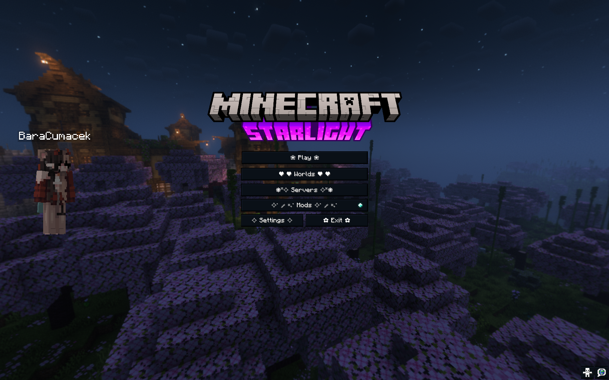
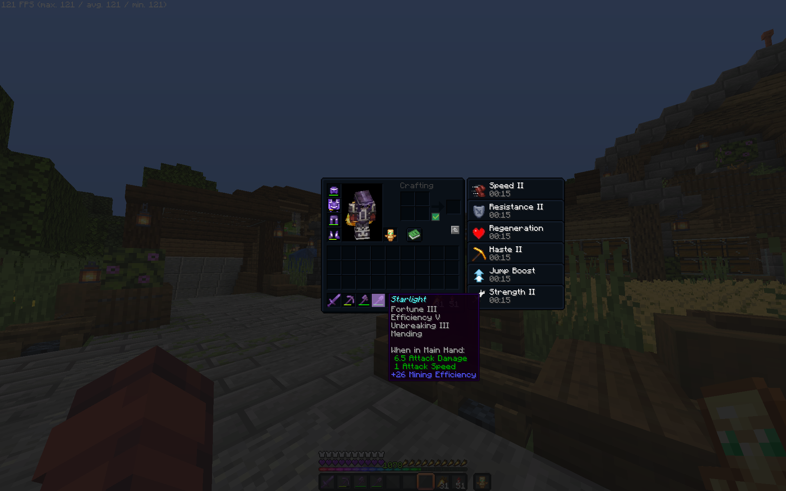
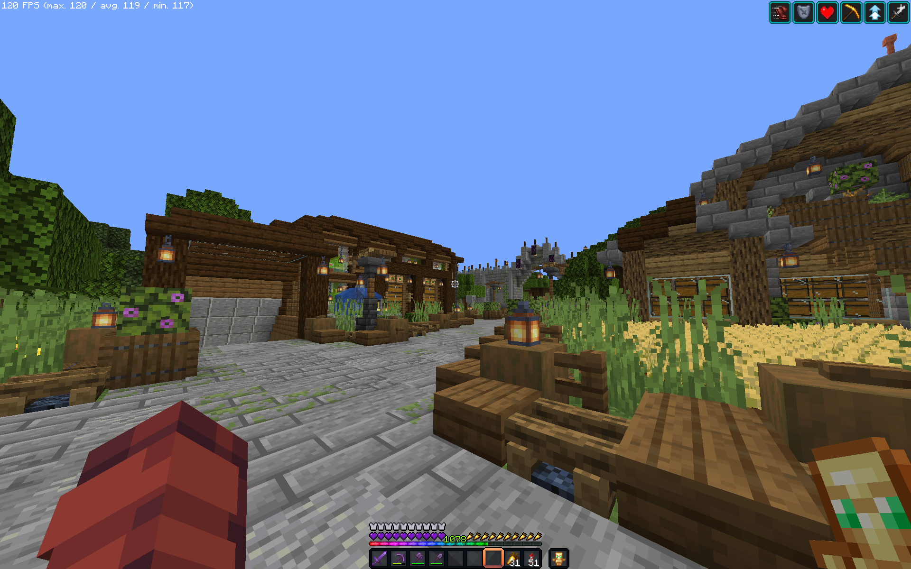
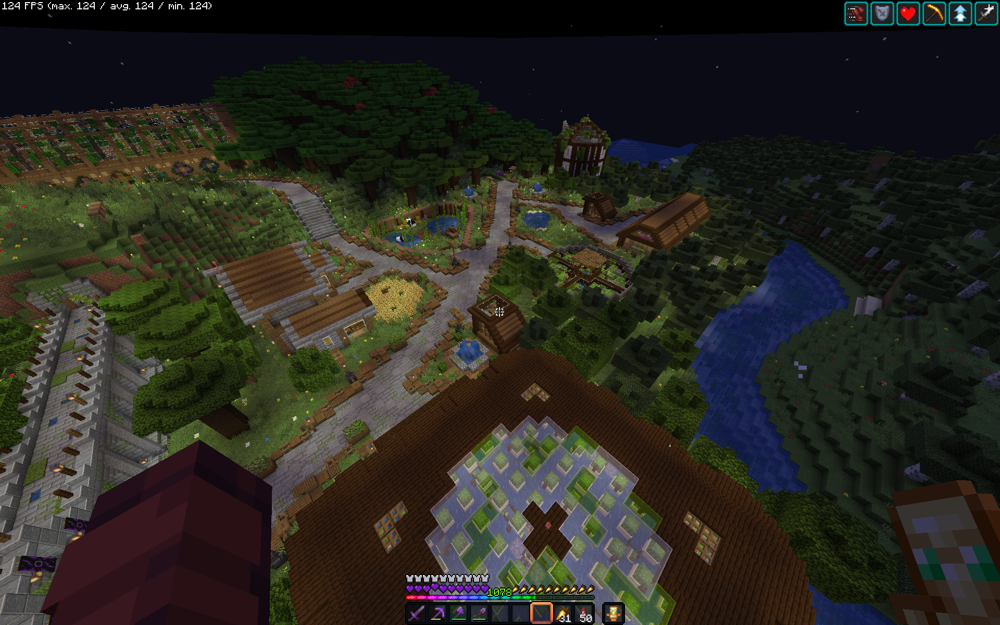

# Starlight

<!-- GITHUB_TAGS_START -->

   

<!-- GITHUB_TAGS_END -->

A lightweight, dark themed **Fabric** modpack focused on performance, technical play, and subtle quality‑of‑life improvements. It includes mods like `litematica` or `carpet`, a lot of optimalization mods, bringing Minecraft from `30 fps` to around `300 fps` on my _Macbook M2 Air_, while not loosing quality.

This modpack is build and managed by [**Azalea**](https://github.com/matejstastny/azalea), a `CLI` modpack manager tool.

## `Install`

#### [Modrinth Launcher](https://modrinth.com/app)

1. Search for **Starlight**, or visit [the website](https://modrinth.com/project/kWqlGiOE)
2. Click **Install**

#### [Prism Launcher](https://prismlauncher.org/)

1. Click on _Add Instance_ in the top left corner
2. Click on **Modrinth** in the left sidebar
3. Search for Starlight, and look for a pink **S** logo

<!-- MODRINTH_REMOVE_START -->

## `Screenshots`

    
    

    
    

<!-- MODRINTH_REMOVE_END -->

## `Contents`

This is the list of content with links and versions. Most of it comes from `Modrinth` but some from `Vanilla Tweaks` or other places.

<b>Modrinth content</b>

<!-- AZALEA_MODLIST_START -->

| Name                                                             | Type         | Side   | Version                  |
| ---------------------------------------------------------------- | ------------ | ------ | ------------------------ |
| ["limitless"-banners](https://modrinth.com/project/z4zsMANd)     | mod          | server | 1.3.0                    |
| [3dskinlayers](https://modrinth.com/project/zV5r3pPn)            | mod          | client | 1.10.1                   |
| [architectury-api](https://modrinth.com/project/lhGA9TYQ)        | mod          | both   | 19.0.1+fabric            |
| [badoptimizations](https://modrinth.com/project/g96Z4WVZ)        | mod          | client | 2.4.1                    |
| [better-advancements](https://modrinth.com/project/Q2OqKxDG)     | mod          | client | 0.4.8.51                 |
| [better-block-entities](https://modrinth.com/project/ONZm0H7Y)   | mod          | client | 1.3.0-rc.2+1.21.11       |
| [c2me-fabric](https://modrinth.com/project/VSNURh3q)             | mod          | both   | 0.3.7+alpha.0.7+1.21.11  |
| [carpet](https://modrinth.com/project/TQTTVgYE)                  | mod          | both   | 1.4.194                  |
| [cherished-worlds](https://modrinth.com/project/3azQ6p0W)        | mod          | client | 15.1.0+1.21.11           |
| [clearviews](https://modrinth.com/project/TwYypE5e)              | mod          | client | 2.0.6                    |
| [clickthrough+](https://modrinth.com/project/fJi8nm80)           | mod          | client | 3.6.2+1.21.11-fabric     |
| [cloth-config](https://modrinth.com/project/9s6osm5g)            | mod          | both   | 21.11.153+fabric         |
| [continuity](https://modrinth.com/project/1IjD5062)              | mod          | client | 3.0.1-beta.1+1.21.11     |
| [enderman-grief](https://modrinth.com/project/LLomXBnX)          | mod          | both   | 1.21.11-1.0.2            |
| [entityculling](https://modrinth.com/project/NNAgCjsB)           | mod          | client | 1.9.5                    |
| [fabric-api](https://modrinth.com/project/P7dR8mSH)              | mod          | both   | 0.141.3+1.21.11          |
| [fabric-language-kotlin](https://modrinth.com/project/Ha28R6CL)  | mod          | both   | 1.13.9+kotlin.2.3.10     |
| [fancy-entity-renderer](https://modrinth.com/project/RQ6INv2n)   | mod          | client | 0.5.4                    |
| [fancymenu](https://modrinth.com/project/Wq5SjeWM)               | mod          | both   | 3.8.4-1.21.11-fabric     |
| [fast-better-grass](https://modrinth.com/project/dspVZXKP)       | resourcepack | client | 1.21.11                  |
| [ferrite-core](https://modrinth.com/project/uXXizFIs)            | mod          | both   | 8.2.0-fabric             |
| [freecam](https://modrinth.com/project/XeEZ3fK2)                 | mod          | client | 1.3.6+mc1.21.11          |
| [immediatelyfast](https://modrinth.com/project/5ZwdcRci)         | mod          | client | 1.14.2+1.21.11-fabric    |
| [immersivemusicmod](https://modrinth.com/project/EgBj3Bnf)       | mod          | client | 1.1.1                    |
| [inventory-profiles-next](https://modrinth.com/project/O7RBXm3n) | mod          | client | fabric-1.21.11-2.2.3     |
| [iris](https://modrinth.com/project/YL57xq9U)                    | mod          | client | 1.10.5+1.21.11-fabric    |
| [jade](https://modrinth.com/project/nvQzSEkH)                    | mod          | both   | 21.1.1+fabric            |
| [konkrete](https://modrinth.com/project/J81TRJWm)                | mod          | both   | 1.9.18-1.21.11-fabric    |
| [libipn](https://modrinth.com/project/onSQdWhM)                  | mod          | client | fabric-1.21.11-6.6.2     |
| [lighty](https://modrinth.com/project/yjvKidNM)                  | mod          | client | 3.1.3+1.21.11            |
| [litematica](https://modrinth.com/project/bEpr0Arc)              | mod          | client | 0.26.0                   |
| [lithium](https://modrinth.com/project/gvQqBUqZ)                 | mod          | both   | mc1.21.11-0.21.3-fabric  |
| [malilib](https://modrinth.com/project/GcWjdA9I)                 | mod          | client | 0.27.6                   |
| [mcwifipnp](https://modrinth.com/project/RTWpcTBp)               | mod          | both   | 1.9.8                    |
| [melody](https://modrinth.com/project/CVT4pFB2)                  | mod          | client | 1.0.15-1.21.11-fabric    |
| [minihud](https://modrinth.com/project/UMxybHE8)                 | mod          | client | 0.38.3                   |
| [miniteleport](https://modrinth.com/project/gmfe94N8)            | mod          | server | 1.1.0+mc1.21.11          |
| [modmenu](https://modrinth.com/project/mOgUt4GM)                 | mod          | client | 17.0.0-beta.2            |
| [new-glowing-ores](https://modrinth.com/project/oL18adaQ)        | resourcepack | client | 2.0-1.21-border          |
| [night-ui](https://modrinth.com/project/JEGWvrJj)                | resourcepack | client | v1.4.2                   |
| [nofortunechest](https://modrinth.com/project/4QufRNTv)          | mod          | client | 1.2+1.21.11              |
| [norecipebook](https://modrinth.com/project/TvL1V8O5)            | mod          | client | 3.12+1.21.11             |
| [phantom-lucidity](https://modrinth.com/project/jp5wZgsb)        | mod          | both   | 1.4.0                    |
| [placeholder-api](https://modrinth.com/project/eXts2L7r)         | mod          | both   | 2.8.2+1.21.10            |
| [reeses-sodium-options](https://modrinth.com/project/Bh37bMuy)   | mod          | client | mc1.21.11-2.0.3+fabric   |
| [rei](https://modrinth.com/project/nfn13YXA)                     | mod          | both   | 21.11.814+fabric         |
| [shulkerboxtooltip](https://modrinth.com/project/2M01OLQq)       | mod          | both   | 5.2.15+1.21.11-fabric    |
| [skinrestorer](https://modrinth.com/project/ghrZDhGW)            | mod          | server | 2.5.0+1.21.11-fabric     |
| [sodium-extra](https://modrinth.com/project/PtjYWJkn)            | mod          | client | mc1.21.11-0.8.3+fabric   |
| [sodium](https://modrinth.com/project/AANobbMI)                  | mod          | client | mc1.21.11-0.8.4-fabric   |
| [tweakeroo](https://modrinth.com/project/t5wuYk45)               | mod          | client | 0.27.5                   |
| [ukulib](https://modrinth.com/project/Y8uFrUil)                  | mod          | client | 1.10.2+1.21.11           |
| [ukus-armor-hud](https://modrinth.com/project/wF189hn9)          | mod          | client | 0.10.2+mc1.21.11         |
| [vmp-fabric](https://modrinth.com/project/wnEe9KBa)              | mod          | both   | 0.2.0+beta.7.227+1.21.11 |
| [wi-zoom](https://modrinth.com/project/o7DitHWP)                 | mod          | client | 1.7-MC1.21.11            |
| [worldedit](https://modrinth.com/project/1u6JkXh5)               | mod          | server | 7.4.0                    |
| [xaeros-minimap](https://modrinth.com/project/1bokaNcj)          | mod          | both   | fabric-1.21.11-25.3.10   |
| [xaeros-world-map](https://modrinth.com/project/NcUtCpym)        | mod          | both   | fabric-1.21.11-1.40.11   |
| [yacl](https://modrinth.com/project/1eAoo2KR)                    | mod          | both   | 3.8.2+1.21.11-fabric     |
| [zannaghs-armor-hider](https://modrinth.com/project/GgG2my3y)    | mod          | both   | fabric-1.21.11-0.7.10    |

<!-- AZALEA_MODLIST_END -->

<b>External content</b>

| Name                                                                                            | Type         | Side   | Version |
| ----------------------------------------------------------------------------------------------- | ------------ | ------ | ------- |
| [Alternate Bedrock](https://vanillatweaks.net/picker/resource-packs/)                           | resourcepack | client | -       |
| [Square Plus Crosshair](https://vanillatweaks.net/picker/resource-packs/)                       | resourcepack | client | -       |
| [Brighter Nether](https://vanillatweaks.net/picker/resource-packs/)                             | resourcepack | client | -       |
| [Golden Carrot Hunger Bar](https://vanillatweaks.net/picker/resource-packs/)                    | resourcepack | client | -       |
| [Purple Hearts](https://vanillatweaks.net/picker/resource-packs/)                               | resourcepack | client | -       |
| [Quiter Minecarts](https://vanillatweaks.net/picker/resource-packs/)                            | resourcepack | client | -       |
| [Quiter Nether Portals](https://vanillatweaks.net/picker/resource-packs/)                       | resourcepack | client | -       |
| [Rainbow Expirience Bar](https://vanillatweaks.net/picker/resource-packs/)                      | resourcepack | client | -       |
| [Reduce Villagers](https://modrinth.com/resourcepack/mute-villagers)                            | resourcepack | client | -       |
| [Mod Crates](https://modrinth.com/resourcepack/mob-crates)                                      | resourcepack | client | -       |
| [Panorama with shaders](<https://modrinth.com/resourcepack/1.20-panorama-with-shaders-(night)>) | resourcepack | client | -       |
| [Small totem](https://modrinth.com/resourcepack/better-small-totem)                             | resourcepack | client | -       |

